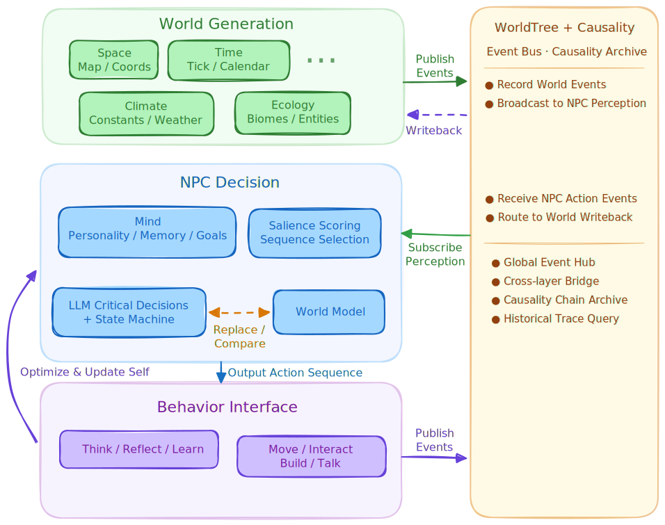

# Ascend

> An AI-native simulation platform that constructs causal worlds bottom-up

English | [中文](README.md)

---

## Positioning

Ascend serves a dual purpose:

**Research platform.** A procedurally constructed world with complete causal mechanisms, plus a structured event causality graph (WorldTree) covering all systems. The research goal is to train a world model for this world from the causality graph and spatiotemporal sequences—Ascend provides a reproducible, intervenable, and traceable environment for this purpose.

**Game.** The player is an individual within the world, steering population evolution through genetic engineering. NPCs are AI-driven—dialogue, decisions, memory, and relationships are all dynamically generated rather than scripted text and behavior trees.

---

## Design Philosophy

### World Before Agent

The world exists prior to any agent—terrain, climate, hydrology, ecology, the passage of time—these constitute the input signals for NPC perception. NPCs are not placed into a static scene; they are born into a causally coherent space that has already been evolving on its own.

### Physical Evolution Drives Semantic Emergence

Temperature is a continuous physical quantity; snowfall is an emergent phenomenon of crossing a semantic threshold. The world presets no semantic states—only physical evolution rules—lifecycles surface naturally as emergent properties of the causal chain.

### AI as First-Class Citizen

Every game system exists primarily to provide structured, retrievable, traceable context for AI NPCs. The gene system, event bus, relationship graph, goal system—each ultimately serves the same mapping: **perception → decision**. The game asks "what world perception does an autonomous agent need to produce believable behavior?"; the research asks "can a world model learn this mapping from causality graphs and spatiotemporal sequences?"—the same question, sharing one data substrate.

---

## Research Motivation

Most existing world model research trains in environments with opaque, non-intervenable causal structure, lacking traceability. On the other side, procedural generation, physical causal simulation, and structured event logging are mature technologies—but rarely have they been deliberately designed for "world model training."

Ascend fills this gap: a reproducible, intervenable causal world produces spatiotemporal sequences to train a world model; the trained model in turn replaces the NPC's LLM decision layer—forming a closed loop of **world generation → data production → model training → feedback to decision**.

---

## System Architecture

> Early-stage blueprint. Module architecture is still evolving.

### Tech Stack

- **Godot 4.x**: rendering, UI, input, audio
- **Python backend** (`backend/`): all core logic
- **Communication**: MessagePack over TCP, localhost
- Dependencies in `requirements.txt`

### Layered Architecture

The system consists of three parts:



**① World Generation Layer** — A procedurally generated causal space that runs and evolves independently. Provides a perception interface (numerical quantities → semantic labels) to NPCs as decision input. State changes are recorded via the event causality graph (WorldTree), both supporting NPC perception and constituting spatiotemporal training samples for the world model.

**② NPC Decision Layer** — Perceives the world, combines personality parameters and memory, outputs actions. LLM is invoked on-demand driven by saliency scoring; the five-layer architecture (role / goal / motivation / skill / execution) in the design docs is a game-side detail, see `docs/心智系统/`. The world model is trained offline on causality graphs and spatiotemporal sequences; once trained, it can replace the LLM decision layer.

**③ Action Interface Layer** — Defines the contract for NPC-selectable actions. The decision layer selects from the action set, executes via the interface, and writes back to the world, which then continues evolving.

### Directory Structure

```
backend/   Python backend (core logic)
frontend/  Godot frontend
docs/             Design documents
lang/             Localization resources
requirements.txt  Python dependencies
```

---

## Design Documents

Full design documents in `docs/`, organized by module (in Chinese):

- [Game Overview & Worldview](docs/游戏综述与世界观.md)
- [Research Proposal & Theory](docs/研究方案与理论.md) — SCM, causal validation, sample complexity
- [World Framework](docs/世界框架/) — physics, time, ecology, event system
- [Life & Individual](docs/生命个体/) — personality, physiology, body
- [Mind System](docs/心智系统/) — AI-native NPCs, goals, skills
- [Gene System](docs/基因系统/) — gene operations, dietary compatibility
- [Group Society](docs/群体社会/) — relationship graph, world simulation, governance
- [Player Actions](docs/玩家行动/) — gameplay progression, building, economy
- [Presentation](docs/表现层/) — visuals, UI, audio

---

## Quick Start

```bash
python -m venv .venv
source .venv/bin/activate
pip install -r requirements.txt
cd backend
python run_server.py
```

The Godot frontend is in `frontend/`, open with Godot 4.x.

---

## License

TBD.
