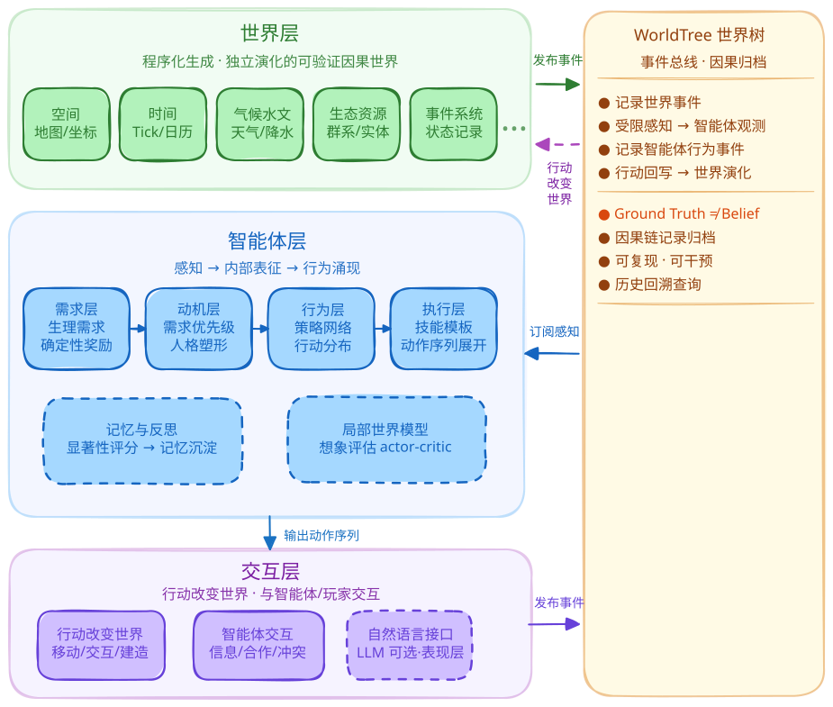

# Ascend

> 构建可验证的因果世界，并研究智能体如何在其中学习、交互与演化的 AI 原生模拟平台。

[English](README.en.md) | 中文

<p align="center">
  
  
  
  
  
  
  
</p>

---

## 项目定位

**Ascend**  是一个面向研究与游戏的 AI 原生世界模拟平台。

核心思想是：

> **先构造一个能够独立运行、可复现、可干预、具有明确 Ground Truth 的因果世界，再研究智能体如何在其中通过自身经验形成认知、学习与行为。**

Ascend 不把世界视为 NPC 的静态背景，而将世界本身作为一个持续演化的系统。

---

## 研究动机

当前许多 AI Agent、世界模型与 NPC 研究存在一个共同问题：

> **智能体所处的世界通常只是数据集、环境接口或不可完全观测的黑箱，而不是一个拥有明确 Ground Truth 因果机制、能够持续演化并接受干预的完整世界。**

这使得很多问题难以被严格回答：

- 智能体究竟学到了什么？
- 它的世界表征与真实世界存在怎样的差异？
- 因果结构在什么条件下能够被恢复？
- 样本复杂度如何随世界复杂度变化？
- 观测噪声、时间依赖和干预覆盖不足会造成多大的误差？
- 错误的因果认知如何影响后续行为？
- 多个具有不同认知的智能体交互后，会产生怎样的群体现象？

Ascend 希望首先解决其中最基础的问题：

> **构造一个可以被严格分析和验证的动态因果世界。**

在此基础上，再逐步引入学习型智能体和社会系统。

---

## 游戏目标

玩家在一个独立演化的世界中生活。可以通过探索、观察、交流、建造、交易、管理、基因编辑、社会互动的方式改变世界与个体的发展轨迹。

---

## 设计理念

### 世界先于智能体

世界先于智能体存在。

地形、气候、水文、生态、时间流逝等系统按照自身的机制持续演化，而不是为了某NPC的行为而即时生成。
NPC与玩家只能通过观察，行动和交互逐步认识这个世界，且NPC不应具有世界之外的先验知识。因此：

$$
Ground\ Truth \neq Agent\ Belief
$$

世界拥有真实状态，而智能体拥有自己的内部表征。

### 世界是可执行的因果系统

世界不是单纯的数据集合，而是一个能够持续运行的程序化系统。
世界状态 $S_t$ 在世界机制和外部干预作用下演化：

$$
S_{t+1}=F(S_t, A_t, U_t, \epsilon_t)
$$

其中：

- $S_t$：世界状态
- $A_t$：智能体与玩家行为
- $U_t$：外部干预
- $\epsilon_t$：随机因素

世界内部的生成机制构成 Ground Truth 因果系统。WorldTree 则对其中的事件、状态变化及因果依赖进行可追踪记录。
因此，世界本身可以被前向模拟、干预、复现，并作为因果研究的实验环境。

### 可复现性

将可复现性视为基础设施，世界生成、随机过程、事件演化以及未来的智能体行为均应具备确定性的重放机制。
这使研究者能够重现实验、比较模型、重放事件、对同一事件进行不同干预。

---

## 系统架构

> 当前为早期阶段蓝图，Agent 与社会系统仍处于设计阶段。

### 技术栈

- **Godot 4.x**：渲染、UI、输入、音频
- **Python 后端**（`backend/`）：全部核心逻辑
- **通信**：JSON over TCP（规划迁移至 MessagePack）
- 依赖见 `requirements.txt`

### 架构分层

系统当前规划为三个相互连接的层次：



**① 世界层** — 程序化生成并持续演化的可验证因果世界，包括地形、气候、水文、生态、资源、时间和事件系统。世界独立于智能体运行，并通过受限的感知接口向智能体提供观测。世界状态变化由事件系统和 WorldTree 记录，用于调试、复现与因果研究。

**② 智能体层** — 智能体通过感知世界、采取行动和获得反馈形成自身的内部状态。其内部可能包含：感知、记忆、信念、需求、目标、学习、决策。具体模型架构将在第二阶段研究中确定。

**③ 交互层** — 智能体通过行动改变世界，并通过与其他智能体和玩家的交互获得新的信息。

---

## 执行阶段

### 第一阶段：可验证因果世界 （施工中）

当前首要目标不是实现NPC， 而是完成世界基座，并验证 WorldTree 与整个因果系统是否足以支撑严格的因果研究，保证其正确性与可解释性。
本阶段最终希望回答：

> **一个具有已知 Ground Truth 的动态因果世界，在什么条件下可以被正确识别？**

以及：

> **当因果模型失效时，失效程度如何随着样本量、结构复杂度、噪声、时间依赖和干预覆盖发生变化？**

#### 阶段 1-A：构建 Ground Truth World

首先构建一个能独立运行的世界，包括：地形、海拔、温度、降雨、水文、气候、生态、时间、天气、资源等。
这些系统确保世界内部存在明确、可执行、可追踪的生成机制的同时，尽量让生成“看起来合理”的世界，以满足游戏设计需求。

#### 阶段 1-B：世界树 WorldTree

使用 **WorldTree** 记录世界中的事件发生与因果结构。
WorldTree 的设计满足研究所需的可追踪性、可验证性、可复现性、时间一致性、干预可定位性。

需要区分：**世界机制本身存在的因果关系** 与 **日志系统为了追踪事件而记录的关系**。二者不完全等价。WorldTree 是对 Ground Truth 因果机制的可计算、可追踪映射，而不是因果关系本身。

#### 阶段 1-C：世界基座验证

在 Agent 加入之前，首先使用受控实验验证因果系统本身。
研究重点包括：评估样本复杂度、误差传播与反事实、Granger等价性、干预采样覆盖、实验结果与理论对照。

---

### 第二阶段：智能体构造 （未开始）

当 Ground Truth World 和因果验证体系稳定后，再引入智能体。
研究问题变为：

> **一个并不知道世界 Ground Truth 的智能体，如何通过自己的经历形成对世界的内部表征？**

#### 智能体不直接获得 Ground Truth

第一阶段已获得由世界生成机制定义的 Ground Truth 因果结构 $G^*$ ，但智能体无法直接访问它。智能体能够获得的信息来自自己的观测 $o_1,o_2,\dots,o_t$ 以及自己的行动 $a_1,a_2,\dots,a_t$。
因此，不同智能体即使处于同一个世界，也可能因为感知能力、初始条件、经历和个体特征不同，而形成不同的世界表征。
第二阶段的具体认知与决策架构本身也是研究对象，而不是预先确定的工程实现。

#### 个体差异与基因

玩家对基因的编辑不仅用于改变传统意义上的数值属性，而是用于改变个体与世界交互的初始条件。
长期目标是研究：

$$
Genome \rightarrow Perception + Needs + Learning + Behavior
$$

不同基因构成的个体可能具有不同的感知能力、生理需求、偏好、学习能力、记忆特征、行为倾向，不同基因构成的个体在同一个世界中经历不同的事件，并因此形成不同的内部表征。

---

### 第三阶段：智能交互（未开始）

当多个智能体同时存在后，研究进一步进入社会层面。
每个智能体拥有自己的 $Belief_i$ 、 $Memory_i$ 、 $Goal_i$ 、 $Experience_i$ ，他们通过行动与交流互相影响，
从而可能出现信息传播、错误认知传播、信任关系、合作冲突、群体行为、社会规范、文化或知识传播。

这些现象不应主要依赖针对具体社会现象的预设规则，而应尽可能从个体层面的认知、学习与交互机制中涌现。

#### 自然语言交流

不计划把大型语言模型定义为NPC的“灵魂”。
NPC的认知、记忆、信念和行为应来自其自身的内部模型与经历。

自然语言可作为人与智能体之间的交互接口。理想情况下，语言模型负责处理开放式自然语言，而不直接决定NPC的世界观与行为。

因此，NPC在没有自然语言接口的情况下，也应能够独立运行。

---

## 目录结构

```
backend/   Python 后端（核心逻辑）
frontend/  Godot 前端
build/     构建与打包
data/      世界内容数据（JSON：地形/群系/气候/天气/世界生成参数）
docs/             设计文档
lang/             多语言资源
research/         研究探针实验脚本（世界基座验证）
requirements.txt  Python 依赖
```

---

## 设计文档

完整设计文档位于 `docs/`，按模块组织：

- [游戏综述与世界观](docs/游戏综述与世界观.md)
- [研究方案与理论](docs/研究方案与理论.md) — SCM、因果验证、样本复杂度
- [研究理论 · 世界基座](docs/研究理论/世界基座/) — 定理、推导、探针实验判据与结果（第一阶段）
- [研究理论 · 反事实与认知](docs/研究理论/反事实与认知/) — 干预、重放、误差预算与认知学习（第二阶段）
- [世界框架](docs/世界框架/) — 物理、时间、生态、事件系统
- [生命个体](docs/生命个体/) — 人格、生理、身体
- [心智系统](docs/心智系统/) — AI 原生 NPC、目标、技能
- [基因系统](docs/基因系统/) — 基因操作、饮食兼容
- [群体社会](docs/群体社会/) — 关系图谱、世界模拟、管理制度
- [玩家行动](docs/玩家行动/) — 玩法进程、建造、经济
- [表现层](docs/表现层/) — 视觉、界面、音频

---

## License

[CC BY-NC-SA 4.0](LICENSE)（商业使用需联系作者授权）
