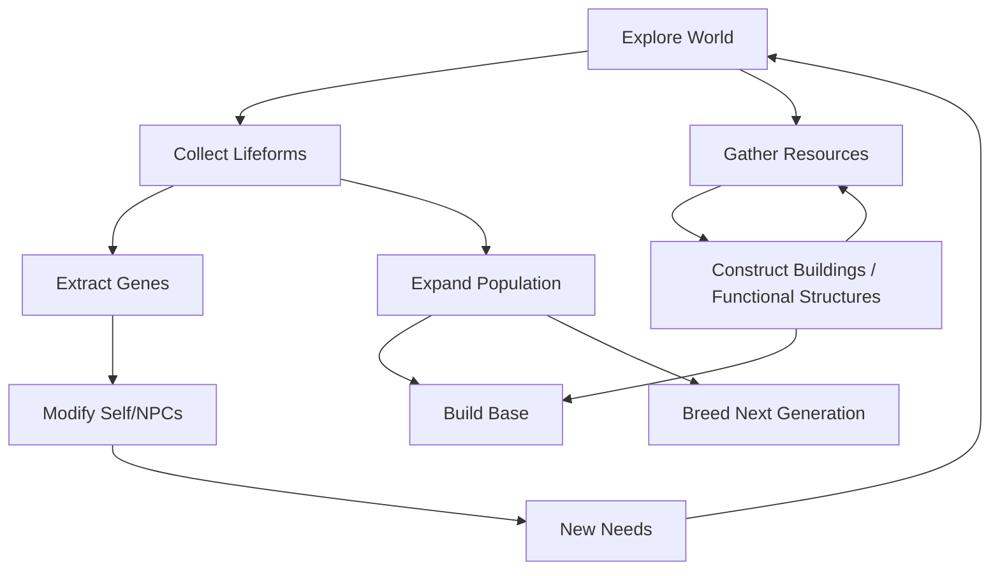

# Game Concept & System Design Document - Ascend (Version 0.1)

## 1. Game Overview

**Ascend** is a survival and management simulation game centered on "population evolution driven by genetic modification". The player, as an individual in the world, influences the course of populations by genetically altering themselves, NPCs, and their offspring within a limited scope.

### 1.1 Genre

* Survival & management, "colonisation" simulation (inspired by: Dwarf Fortress, RimWorld, Stellaris, Minecraft)
* AI-driven NPC social system
* Multiple intelligent species, genetic modification and fusion
* 2D top-down minimalist scene

### 1.2 Core Systems

#### AI-Driven NPC Behaviour and Decision-Making

To address foreseeable performance constraints, the AI is preliminarily divided into four components: Decision Layer, Motivation Layer, Execution Layer, and Memory.

* **Decision Layer**: Uses reinforcement learning to determine long-term goals and plans, e.g., gathering, building, socialising, exploration, etc.
* **Motivation Layer**: Prioritises actions based on psychological (desires) and physiological needs.
* **Execution Layer**: Uses state machines to determine action sequences.
* **Memory**: Consists of short-term memory (recent interactions, context) and long-term memory (experience, story, relationships), which are accessible to the decision and motivation layers. Memory context embeddings can be used in the decision layer’s policy at each step (similar to a RAG architecture).

_Note: Reinforcement learning combined with genetic variation may make parameter tuning expensive. Consider starting with a traditional implementation and gradually replacing it._

#### Genetic Fusion / Heredity System

* Gene modules are discrete rather than continuous values.
* No optimal gene combination exists.
* Genetic mutations and degradation are possible.
* The system should ensure that the player is “designing organisms” rather than “gambling on probabilities.”

_Note: The pace of heredity must be carefully managed: if the process is too slow, gameplay will be prolonged; if too fast, NPCs may lose emotional value to the player._

#### Needs and Abilities Based on Genetic Differences

Different genes affect individual abilities and needs, influencing NPC behavior and decisions.

**Since NPCs make autonomous decisions in the game world, world-building should favor clarity over unnecessary complexity.**

#### Social / Population Management System

The world simulation is divided into player-visible layer, proximal layer, and abstract layer.

* In the **player-visible layer**, NPCs act individually.
* In the **proximal layer**, populations make collective decisions (may require separate AI logic).
* The **abstract layer** retains only numerical representations (optional; hard to correspond to actual game state).

Players can manage their own populations, (**Are there NPCs with management capabilities in other populations? If yes, the proximal layer populations may leverage their management AI.**)
The player functions primarily as a rule-setter, rather than a direct controller.

## 2. Worldview Foundation (Early Version)

**Core Question**: _“Amid constant self-modification of the body, can intelligent beings retain their original will?”_

To make players contemplate this question, optimal strategies must inherently betray it: pursuit of efficiency, strength, or social stability comes at the cost of original form and volition.

Hence, each gene should at minimum have three linked effects:

1. **Ability**: capability / efficiency

2. **Needs**: resource consumption / environmental dependencies

3. **Social preference**: relationships / rules

### Setting Overview

Civilizations have never ceased self-modification.
On this continent, life is no longer bound by fixed forms or lineage. Genes can be deconstructed, recombined, inherited, or discarded.

The player, as a pioneer in biotechnology, establishes a base, studies life forms, and attempts to create a population capable of surviving harsh environments through genetic modification and reproduction.

As modifications deepen, life’s forms, needs, and social structures gradually change.
Players must balance **survival efficiency** against the **essence of life**, ultimately deciding the trajectory of civilisation.

## 3. Core Gameplay Loop

### 3.1 Main Loop

#### 1）Explore the World

* Collect lifeform samples
* Interact with other populations (cooperation/conflict)
* Recruit additional individuals to the player’s population
* Address the population’s basic needs

#### 2）Genetic Research

* Analyse samples in the laboratory → gene modules
* Upgrade on genetic technology tree

#### 3）Modification

* Combine gene modules
* Induce mutations (potentially with negative effects)
* Form new species

#### 4）Breeding

* NPC reproduce next generation
* Offspring inherit one parent’s genes
* Mutations or lineage breaks may occur

#### 4）Population Management

* Assign NPCs to tasks based on abilities or work efficiency
* Address the various needs of NPCs (or let them handle themselves?)
* Set rules for NPCs: under rules, NPCs act freely (or NPCs may set their own rules, which means players can only influence indirectly)
* Reward/punishment system: if players punish NPCs for rule violations or other behaviours, NPCs can understand the cause and consequently adapt their behaviour.

### 3.2 Failure Conditions

Since the player is an entity in the world and shares the same fundamentals as NPCs, player death is the only game-over condition.
Other negative events, such as gene degradation, social collapse, or nonviable offspring, are reversible failures. The player can start over as long as they remain alive.
Player death can result from external factors (e.g., being killed, extreme cold) or internal factors (e.g., aging, disease).

_Note: It may be useful to separate physical and mental states. Even if mental independence from the body is not implemented, the code architecture should ideally support separation._

## 4. Visual Presentation

### 4.1 Environment

* 2D top-down / isometric minimalist style
* Modular tiles for buildings and natural scenes
* Map similar to Minecraft, featuring varied terrain, procedural generation, and infinite extension, but without vertical terrain variation
* Characters resemble JRPG-style sprites, assembled from multiple layers
* Genetic differences affect appearance via simple shapes or textures

## 5.Preliminary Implementation

For the MVP version, the following should be implemented:

* One intelligent species, several plant and animal species
* 10–15 gene modules
* Basic world construction
* A playable loop (exploration → modification → behaviour change)
* NPC decision-making framework

## 6. Player Pacing and Experience

### 6.1 Design Goals

The game exists in a tension between understandable order and gradually emerging, uncontrolled complexity.
For most of the time, players should feel that they are making rational and effective decisions. However, as the game progresses, they will gradually realise that these “optimal decisions” are fundamentally reshaping both individuals and populations. The sense of control is not removed abruptly, but slowly reframed.

### 6.2 Pacing Characteristics

#### 6.2.1. Decision Frequency: Low Frequency, High Impact

* Players are not required to issue frequent micromanagement commands.
* Each major decision (e.g. genetic modification, rule setting) remains effective over a long period of time.
* Most consequences are not immediate; instead, they manifest gradually through changes in behaviour, needs, and social structure.

In the early game, players must intervene frequently in survival-related matters. At this stage, system complexity is low, but interaction density is high.
As genetic systems and social rules mature in the mid-game, NPCs can autonomously resolve most problems. Player input frequency decreases, while decision complexity increases.
In the late game, players primarily observe the system in operation, and the overall pace slows down.

#### 6.1.2. Failure Pacing and Error Tolerance

The game allows for frequent small-scale failures, most of which are repairable, adjustable, and reversible.
True failure (player death) is preceded by a long warning period composed of smaller failures. Since the game is designed around long-term saves, accidental player death should be minimised, and if it occurs, it should be largely confined to the early game.
