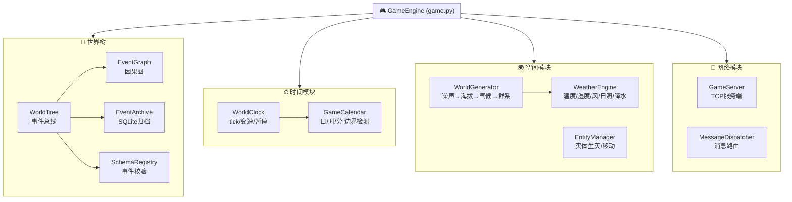
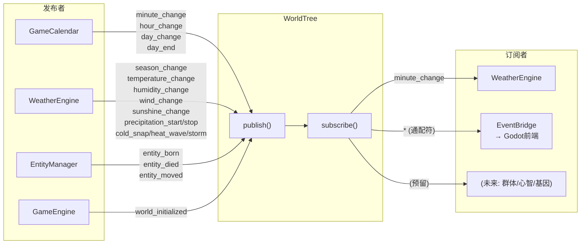
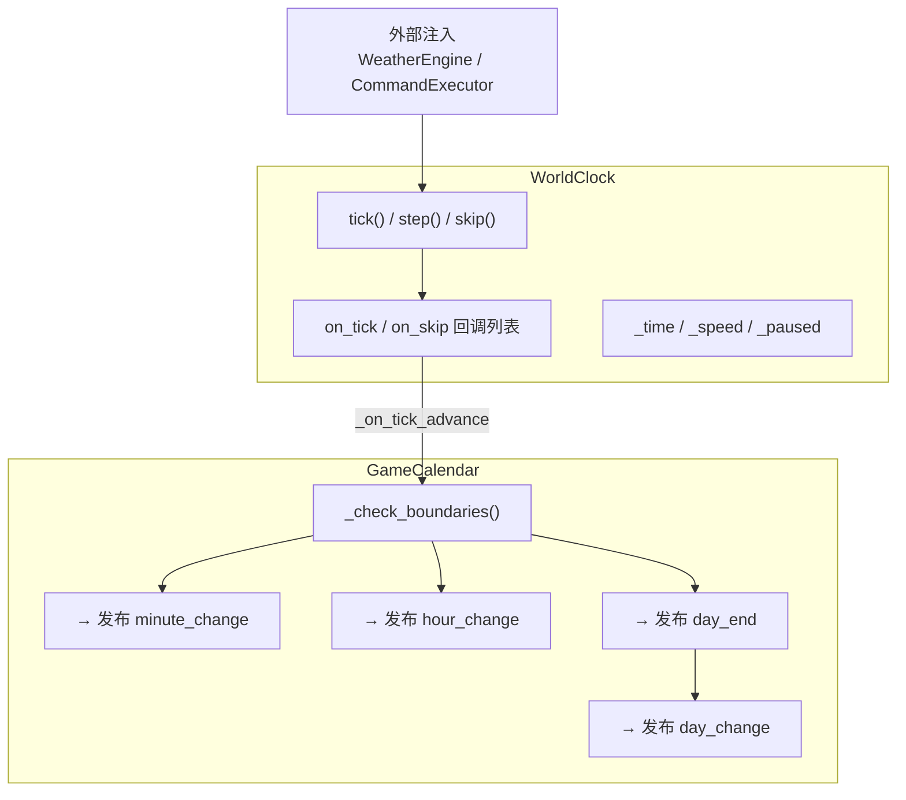
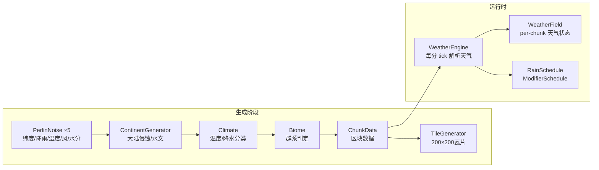
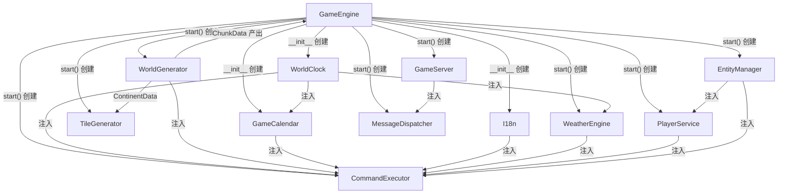
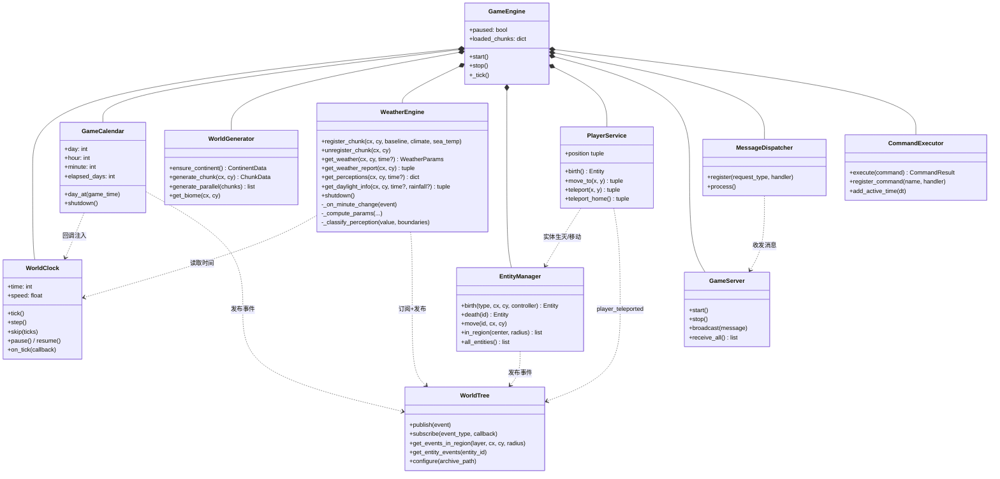

# Ascend 后端架构图

## 1. 模块分层总览

```mermaid
graph TD
    subgraph GameEngine["🎮 GameEngine (game.py)"]
        direction LR
    end

    subgraph WorldTree["🌳 世界树"]
        WT_Tree["WorldTree<br/>事件总线"]
        WT_Graph["EventGraph<br/>因果图"]
        WT_Archive["EventArchive<br/>SQLite归档"]
        WT_Schema["SchemaRegistry<br/>事件校验"]
    end

    subgraph Time["⏰ 时间模块"]
        CLK["WorldClock<br/>tick/变速/暂停"]
        CAL["GameCalendar<br/>日/时/分 边界检测"]
    end

    subgraph Space["🌍 空间模块"]
        GEN["WorldGenerator<br/>噪声→海拔→气候→群系"]
        WEA["WeatherEngine<br/>温度/湿度/风/日照/降水"]
        ENT["EntityManager<br/>实体生灭/移动"]
    end

    subgraph Net["📡 网络模块"]
        SRV["GameServer<br/>TCP服务端"]
        DISP["MessageDispatcher<br/>消息路由"]
    end

    WT_Tree --> WT_Graph
    WT_Tree --> WT_Archive
    WT_Tree --> WT_Schema
    CLK --> CAL
    GEN --> WEA

    GameEngine --> WorldTree
    GameEngine --> Time
    GameEngine --> Space
    GameEngine --> Net
```

## 2. 事件流转图

```mermaid
graph LR
    subgraph 发布者
        CAL2["GameCalendar"]
        WEA2["WeatherEngine"]
        ENT2["EntityManager"]
        GAME2["GameEngine"]
    end

    subgraph WorldTree2["WorldTree"]
        PUB["publish()"]
        SUB["subscribe()"]
    end

    subgraph 订阅者
        WEA_SUB["WeatherEngine"]
        BRIDGE["EventBridge<br/>→ Godot前端"]
        FUTURE["(未来: 群体/心智/基因)"]
    end

    CAL2 -->|"minute_change<br/>hour_change<br/>day_change<br/>day_end"| PUB
    WEA2 -->|"season_change<br/>temperature_change<br/>humidity_change<br/>wind_change<br/>sunshine_change<br/>precipitation_start/stop<br/>cold_snap/heat_wave/storm"| PUB
    ENT2 -->|"entity_born<br/>entity_died<br/>entity_moved"| PUB
    GAME2 -->|"world_initialized"| PUB

    PUB --> SUB
    SUB -->|"minute_change"| WEA_SUB
    SUB -->|"* (通配符)"| BRIDGE
    SUB -->|"(预留)"| FUTURE
```

## 3. 时间模块内部

```mermaid
graph TD
    subgraph Clock["WorldClock"]
        TICK["tick() / step() / skip()"]
        CB["on_tick / on_skip 回调列表"]
        STATE["_time / _speed / _paused"]
    end

    subgraph Calendar["GameCalendar"]
        BOUND["_check_boundaries()"]
        MIN["→ 发布 minute_change"]
        HOUR["→ 发布 hour_change"]
        DAY_END["→ 发布 day_end"]
        DAY["→ 发布 day_change"]
    end

    TICK --> CB
    CB -->|"_on_tick_advance"| BOUND
    BOUND --> MIN
    BOUND --> HOUR
    BOUND --> DAY_END
    DAY_END --> DAY

    CAL_INJECT["外部注入<br/>WeatherEngine / CommandExecutor"] --> TICK
```

## 4. 空间模块管线

```mermaid
graph LR
    subgraph 生成阶段
        NOISE["PerlinNoise ×5<br/>纬度/降雨/湿度/风/水分"]
        CONT["ContinentGenerator<br/>大陆侵蚀/水文"]
        CLIMATE["Climate<br/>温度/降水分类"]
        BIOME["Biome<br/>群系判定"]
        CHUNK["ChunkData<br/>区块数据"]
        TILE["TileGenerator<br/>200×200瓦片"]
    end

    subgraph 运行时
        WEA_RUN["WeatherEngine<br/>每分 tick 解析天气"]
        FIELD["WeatherField<br/>per-chunk 天气状态"]
        SCHED["RainSchedule<br/>ModifierSchedule"]
    end

    NOISE --> CONT
    CONT --> CLIMATE
    CLIMATE --> BIOME
    BIOME --> CHUNK
    CHUNK --> TILE
    CHUNK --> WEA_RUN
    WEA_RUN --> FIELD
    WEA_RUN --> SCHED
```

## 5. GameEngine 编排与组合

```mermaid
graph TD
    GE["GameEngine"]

    GE -->|"__init__ 创建"| CLK3["WorldClock"]
    GE -->|"__init__ 创建"| CAL3["GameCalendar"]
    GE -->|"__init__ 创建"| I18N["I18n"]

    GE -->|"start() 创建"| GEN3["WorldGenerator"]
    GE -->|"start() 创建"| TILE3["TileGenerator"]
    GE -->|"start() 创建"| ENT3["EntityManager"]
    GE -->|"start() 创建"| PLR3["PlayerService"]
    GE -->|"start() 创建"| WEA3["WeatherEngine"]
    GE -->|"start() 创建"| SRV3["GameServer"]
    GE -->|"start() 创建"| DISP3["MessageDispatcher"]
    GE -->|"start() 创建"| CMD3["CommandExecutor"]

    CLK3 -->|注入| CAL3
    CLK3 -->|注入| WEA3
    CLK3 -->|注入| CMD3

    GEN3 -->|"ContinentData"| TILE3
    GEN3 -->|注入| CMD3

    CAL3 -->|注入| CMD3
    I18N -->|注入| CMD3
    WEA3 -->|注入| CMD3
    PLR3 -->|注入| CMD3
    ENT3 -->|注入| CMD3

    ENT3 -->|注入| PLR3

    SRV3 -->|注入| DISP3

    GEN3 -->|"ChunkData 产出"| GE
```

## 6. 类继承与接口关系

```mermaid
classDiagram
    class GameEngine {
        +start()
        +stop()
        +_tick()
        +paused: bool
        +loaded_chunks: dict
    }

    class WorldTree {
        +publish(event)
        +subscribe(event_type, callback)
        +get_events_in_region(layer, cx, cy, radius)
        +get_entity_events(entity_id)
        +configure(archive_path)
    }

    class WorldClock {
        +tick()
        +step()
        +skip(ticks)
        +pause() / resume()
        +on_tick(callback)
        +time: int
        +speed: float
    }

    class GameCalendar {
        +day: int
        +hour: int
        +minute: int
        +elapsed_days: int
        +day_at(game_time)
        +shutdown()
    }

    class WorldGenerator {
        +ensure_continent() ContinentData
        +generate_chunk(cx, cy) ChunkData
        +generate_parallel(chunks) list
        +get_biome(cx, cy)
    }

    class WeatherEngine {
        +register_chunk(cx, cy, baseline, climate, sea_temp)
        +unregister_chunk(cx, cy)
        +get_weather(cx, cy, time?) WeatherParams
        +get_weather_report(cx, cy) tuple
        +get_perceptions(cx, cy, time?) dict
        +get_daylight_info(cx, cy, time?, rainfall?) tuple
        +shutdown()
        -_on_minute_change(event)
        -_compute_params(...)
        -_classify_perception(value, boundaries)
    }

    class EntityManager {
        +birth(type, cx, cy, controller) Entity
        +death(id) Entity
        +move(id, cx, cy)
        +in_region(center, radius) list
        +all_entities() list
    }

    class PlayerService {
        +birth() Entity
        +position tuple
        +move_to(x, y) tuple
        +teleport(x, y) tuple
        +teleport_home() tuple
    }

    class GameServer {
        +start()
        +stop()
        +broadcast(message)
        +receive_all() list
    }

    class MessageDispatcher {
        +register(request_type, handler)
        +process()
    }

    class CommandExecutor {
        +execute(command) CommandResult
        +register_command(name, handler)
        +add_active_time(dt)
    }

    GameEngine *-- WorldClock
    GameEngine *-- GameCalendar
    GameEngine *-- WorldGenerator
    GameEngine *-- WeatherEngine
    GameEngine *-- EntityManager
    GameEngine *-- PlayerService
    GameEngine *-- GameServer
    GameEngine *-- MessageDispatcher
    GameEngine *-- CommandExecutor

    GameCalendar ..> WorldClock : 回调注入
    GameCalendar ..> WorldTree : 发布事件
    WeatherEngine ..> WorldClock : 读取时间
    WeatherEngine ..> WorldTree : 订阅+发布
    EntityManager ..> WorldTree : 发布事件
    PlayerService ..> EntityManager : 实体生灭/移动
    PlayerService ..> WorldTree : player_teleported
    MessageDispatcher ..> GameServer : 收发消息
```
