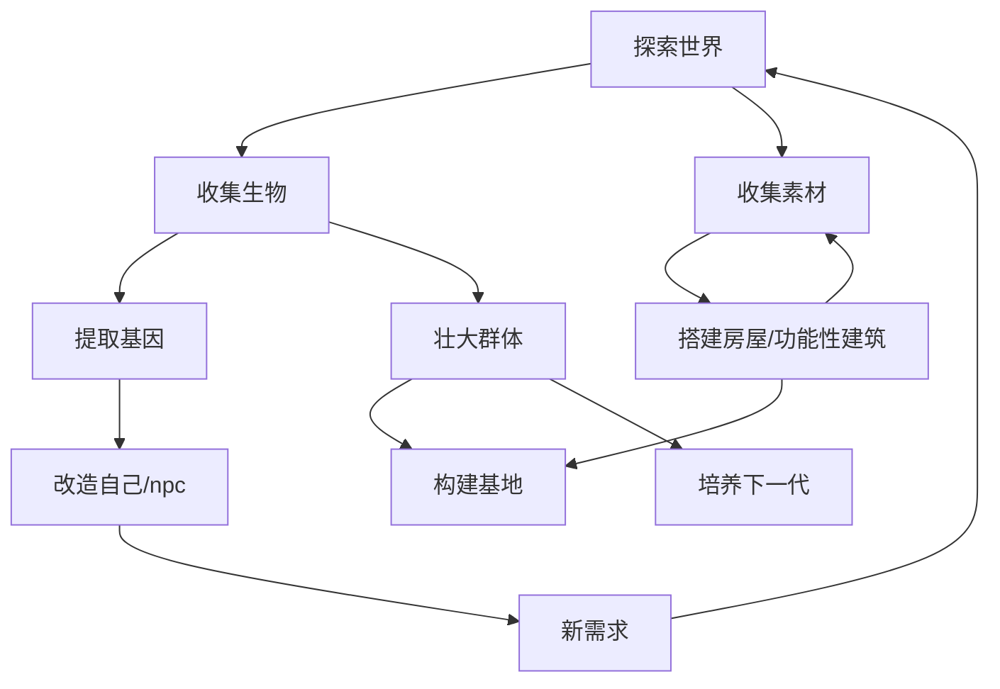

# 《Ascend》游戏初期设计文档（GDD v0.1）

## 1. 游戏概要

《Ascend》是一款以“基因改造驱动群体演化”为核心的生存经营模拟游戏。
玩家作为世界中的一名个体，通过改变自身，改变npc与后代，在有限范围内影响群体的走向。

### 1.1 游戏类型

* 生存经营，"殖民"模拟 （参考矮人要塞，Rimworld，群星，我的世界）
* AI 驱动npc社会系统
* 多种族，基因改造、融合
* 2D 俯视极简场景

### 1.2 核心系统

#### AI 驱动的 NPC 行为与决策

基于可预见的性能开销问题，初步把AI分为决策层，动机层，执行层和记忆模块。
决策层使用强化学习，用来决定NPC的长期目标/计划，例如采集，建造，社交，探索等。
动机层基于心理(欲望)、生理需求等整理动作优先级。
执行层使用状态机确定具体动作序列。
记忆模块分短期（最近交互，情境）和长期（经验，情节，关系），供决策层和动机层调用。
可以在决策层的policy中每步调用记忆的context embedding来参与决策（类似RAG架构）

_决策层的强化学习加上基因造成的差异可能造成调参的成本过高。考虑先用传统实现，后慢慢替换。_

#### 基因拼接/遗传系统

基因模块是离散的，非连续数值
不存在最优基因组合
存在基因突变，退化的可能。需注意保持玩家在“设计生物”，而非“赌概率”
遗传系统的节奏需要把控。如果成长太慢，游戏时长会被拉的过长；如果太快，npc个体会失去情感价值。

#### 基于基因差异的需求与能力系统

不同的基因会影响个体的能力和需求，从而影响npc的行为和决策。
**因为npc要在游戏的世界中进行决策，对于世界构建不应追求复杂，应该追求清晰**

#### 社会/群体管理系统

把世界的模拟分解为玩家可见层，临近层，和抽象层。
玩家可见层中，npc以个体为单位行动。临近层中，以种群作为一个整体进行决策 _(可能需要单独设计AI逻辑)_
抽象层中，只保留数值化呈现 _(可能不需要，难以让数值和实际情况挂上钩)_

玩家对自己的种群有管理能力, **其他种群中有没有具备管理能力的npc？如果有那么临近层中的种群可以使用管理者的AI**
对玩家而言，玩家偏向于“规则制定者”，而非“控制者”

## 2.世界观基础（初版）

核心命题：_“在肉体的不断自我改造中，智慧生命还能保持原本意志吗？”_

要让玩家思考这个命题，需要在玩家思考最优解的时候背叛这句话。
也就是说追求高效率，强，社会稳定等正面效果时伴随着原本形态与意志的改变。
即对单个基因而言，至少绑定三层效果：能力（能力/效率），需求（资源消耗/环境依赖），群体偏好（关系/规则）。

### 设定概述

文明从未停止过对自身的改造。
在这片大陆上，生命不再被固定的形态与血统所束缚。基因可以被拆解、重组、继承，甚至被抛弃。
玩家作为一名生物科技的先行者，建立基地、研究生命结构，并尝试通过基因改造与繁衍，塑造一个能够在严酷环境中生存下去的族群。
随着改造的不断深入，生命的形态、需求与社会结构逐渐发生变化。
玩家需要在“生存效率”与“生命本质”之间做出选择，决定文明最终将走向何处。

## 3. 核心玩法循环

### 3.1 大循环

#### 1）探索世界

* 收集生物样本
* 与其他种群的营地/城镇交互（合作/冲突）
* 会有其他个体加入玩家群体
* 解决玩家群体的衣食住行

#### 2）研究基因

* 实验室解析样本 → 特征模块
* 升级基因科技树

#### 3）改造

* 拼接特征模块
* 变异（可能带负面效果）
* 形成新种族

#### 4）培育

* 生育或让他人生育培育下一代
* 子女继承父母某一方基因
* 可能突变或断代

#### 4）群体经营

* 根据不同的能力，npc去做不同的工作或提升工作效率
* 解决群体中成员npc的各种需求 （或者npc自己能解决？）
* 给npc设置规矩，在规则下npc可以自由行动 （npc自己应该也可以给自己设置规则，那么玩家只能间接设置？）
* 有奖惩机制，玩家如果因为npc触犯规矩或者其他行为惩罚npc，npc要清楚原因，并改变行为策略

### 3.2 失败

因为玩家作为世界的一员，设定上与npc没有本质不同，那么玩家死亡就是游戏失败的唯一评判标准。
其他的负面事件如基因退化，社会结构崩溃，后代无法生存等均为可逆的失败。玩家只要不死，就可以重头来过。
玩家死亡可以是外部因素如被杀，极寒等，也可能是自身因素如寿命，疾病。

_可能需要把肉体和精神分开看待。虽然不一定会做精神独立与肉体存在的情况，但是代码架构上最好分开。_

## 4. 视觉呈现

### 4.1 场景表现

* 2D 俯视 / 等距简约风
* 模块化 tile 构成建筑、自然场景
* 地图类似Minecraft，有不同地形，自动生成，无限延伸。但不做地形起伏
* 小人类似jrpg，使用不同图层拼接出整体外观
* 基因导致的外观差异以简单形状或纹理呈现

## 5.初步实现

作为初版mvp，要实现：

* 一个智慧种族，若干种动植物
* 10-15个基因模块
* 基础世界的搭建
* 一个可玩循环（探索 → 改造 → 行为变化）
* NPC决策的架构

## 6. 玩家节奏与体验

### 6.1 设计目标

游戏在可理解的秩序与逐渐失控的复杂性之间。
玩家大部分时间内感到自己在做出理性，有效的决策。但随着游戏推进，会逐渐意识到这些“最优决策”正在改变个体与群体。

### 6.2 节奏特征

#### 6.2.1. 决策频率：低频、高权重

* 玩家不需要频繁下达具体指令
* 每一次关键决策（基因改造、规则设定）都会在较长时间内持续生效
* 多数后果并非即时反馈，而是通过行为变化、需求变化和社会结构变化逐步体现

游戏早期，玩家需要频繁介入生存相关事务。这时系统复杂度低，但操作密度高。
随着规则与基因体系成熟，游戏中期NPC可以自主解决大部分问题。玩家操作次数减少，但决策复杂度提升。
游戏后期玩家更多是在观察系统运行，节奏放缓。

#### 6.1.2. 失败节奏与容错

游戏允许频繁的小规模失败，且多数失败是可修复、可调整、可逆的。
真正的失败（玩家死亡）通过小规模失败有较长的预兆期。因为是长期存档的形式，玩家意外死亡的情况应该减少，有也需控制在前期。

