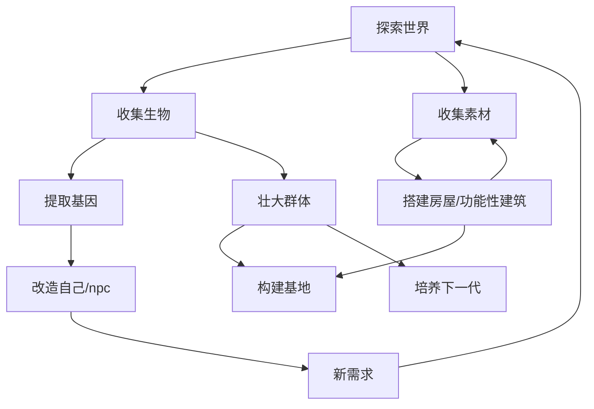

# 核心玩法循环

_玩家始终可以选择只以个体视角游玩——管理能力是设施和 NPC 提供的，不是强制角色。玩家不管，自然有 NPC 填补管理真空。_

**核心体验：观察 AI 驱动的 NPC 如何被你改变。** 基因编辑不是终点——你改了一条基因，然后看这个 NPC 怎么想、怎么说、怎么做、与其他人产生什么新冲突。每一次基因操作都是一次实验，AI NPC 的行为是实验结果。

## 大循环

### 1）探索世界：寻找生物

探索的核心驱动力是**发现新生物和特殊个体**。生物分为两种类型：

**非智慧生物**（动植物，无灵魂）

携带两种特征：
- **显性特征**：外观（颜色、体型、纹理）、功能性器官（角、翼、甲壳）——在探索中肉眼可观察，产生捕获冲动
- **隐性特征**：生理属性、行为倾向、隐藏基因效果——捕获后在实验室研究时揭示

获取方式：通过工具、陷阱、麻醉等方法捕获活体。接近时生物有行为模式（警觉/逃跑/对峙/攻击），需要观察和策略，而非战斗。失败的结果是标本逃跑/损坏或玩家受伤（能力暂时下降），极端情况才致命。

采集植物在探索中顺手进行——野外植物散布在地图，按生物群落分布。所见即所得：外观特征（颜色、大小、果实）可见，隐性属性（产量、抗性、营养值）需实验室分析。采集是零基建的食物来源，够个人或小团体（3-5 人）维持，但野生再生速度锁死规模上限。每个可种植作物的最初来源都是野外采集的样本。

**智慧生物**（拥有与玩家同质的意识）

同样存在显性和隐性特征，但获取基因的路径不同：
- 死后研究——遗体提取，但基因会降解
- 交换研究——帮助对方族群解决具体问题换取研究许可
- 文化与信仰差异——少数个体因自身文化特殊性自愿接受，稀有且不可预期

同一物种在不同区域可能出现微小的基因漂移，产生值得寻找的变异个体。

### 2）研究基因：科技树与提取难度

- 实验室解析样本 → 揭示生物的全部特征（隐性→显性）
- 基因有**提取难度**等级：基础基因可直接提取，高级基因需要升级科技树后才能解锁提取能力
- 科技树推进依赖：持续研究新样本 + 资源投入 + 已提取基因数量的累积
- 同一个体可能携带玩家当前科技无法提取的基因——这制造了"标记地点、科技达标后再回来"的长线动力

### 3）改造

- 在实验室中将特征模块拼接到目标个体
- 兼容性矩阵显示基因间冲突和增益
- 变异可能带来负面效果
- 效果即时展示在面板上

### 4）培育（育种）

育种不是实验室编辑的慢速替代品，而是**基因发现的引擎**：

- 两个个体交配，后代的基因组合可能产生父母都没有的全新表达
- 实验室编辑只能在已知基因模块中选择拼接；育种却能生成自然界和实验室都不存在的变体
- 新基因经育种出现后，可反过来送入实验室提取，供精准编辑使用

循环：探索收集 → 实验室提取 → 编辑NPC看效果 → 效果好的两个个体育种 → 后代产生新基因表达 → 实验室提取新基因 → 编辑其他个体

基因自动生成：开发者只写 10-15 个基础模板，数百种基因变体通过数值重组和突变自动产出。

### 5）群体经营

- 根据能力差异，NPC自主从事不同工作
- 通过建立设施和制定规则间接引导NPC行为
- NPC可以自主设置规则，玩家通过设施施加影响
- 奖惩机制使NPC理解因果并改变行为策略

### 6）观察与对话：AI NPC 互动的核心

这是本游戏与其他模拟经营类游戏最根本的区别。**NPC 的对话和行为由 LLM 驱动，不是预设文本。**

- **对话是自然语言**：你与任何智慧 NPC 的对话是 LLM 实时生成的。NPC 对你的态度取决于它对你的关系值，说话的内容基于它的近期行为记录和记忆
- **对话产生后果**：对话不仅是获取信息的手段，本身就在改变关系值、产生行为记录、传递信息不对称
- **观察取代查询**：想知道某条基因改造是否有效？不是看面板弹窗——而是观察该 NPC 的行为变化，去档案室查它的行为记录，或者直接跟它和它周围的人交谈
- **信息获取是社交行为**：你不能直接查询 NPC-A 对 NPC-B 的看法。你必须跟 NPC-A 建立信任后对话获取，或者跟了解内情的 NPC-C 交谈。AI 驱动的 NPC 使每次交谈都不可预测——你永远不知道会听到什么
- **档案室是核心设施**：你在野外时，AI NPC 之间也在产生对话和行为。建造档案室后，你可以查阅不在场时发生的对话摘要和事件——这是你理解群体动态的主要窗口

## 玩家节奏与体验

### 设计目标

游戏在可理解的秩序与逐渐失控的复杂性之间。
玩家大部分时间内感到自己在做出理性，有效的决策。但随着游戏推进，会逐渐意识到这些"最优决策"正在改变个体与群体。

**AI 原生 NPC 是这一目标的核心推动力。** 传统模拟经营游戏的 NPC 行为最终会被玩家完全预测——因为行为树是有限的。AI 驱动的 NPC 使群体行为具有不可穷尽的变数：你可以理解趋势，但无法预测每个个体的下一次对话、下一个决定。

### 节奏特征

#### 决策频率：低频、高权重

- 玩家不需要频繁下达具体指令
- 每一次关键决策（基因改造、规则设定）都会在较长时间内持续生效
- 多数后果并非即时反馈，而是通过 AI NPC 的行为变化、需求变化和社会结构变化逐步体现
- **观察替代操作**：中后期玩家的主要动作不是"点击按钮"，而是观察、对话、查阅记录——试图理解你上一次基因操作带来的连锁反应

游戏早期，玩家需要频繁介入生存相关事务。这时系统复杂度低，但操作密度高。
随着规则与基因体系成熟，游戏中期NPC可以自主解决大部分问题。玩家操作次数减少，但决策复杂度提升。
游戏后期玩家更多是在观察 AI NPC 自组织的系统运行，尝试理解发生了什么——节奏放缓，但认知密度升高。

#### 失败节奏与容错

游戏允许频繁的小规模失败，且多数失败是可修复、可调整、可逆的。
真正的失败（玩家死亡）通过小规模失败有较长的预兆期。因为是长期存档的形式，玩家意外死亡的情况应该减少，有也需控制在前期。
